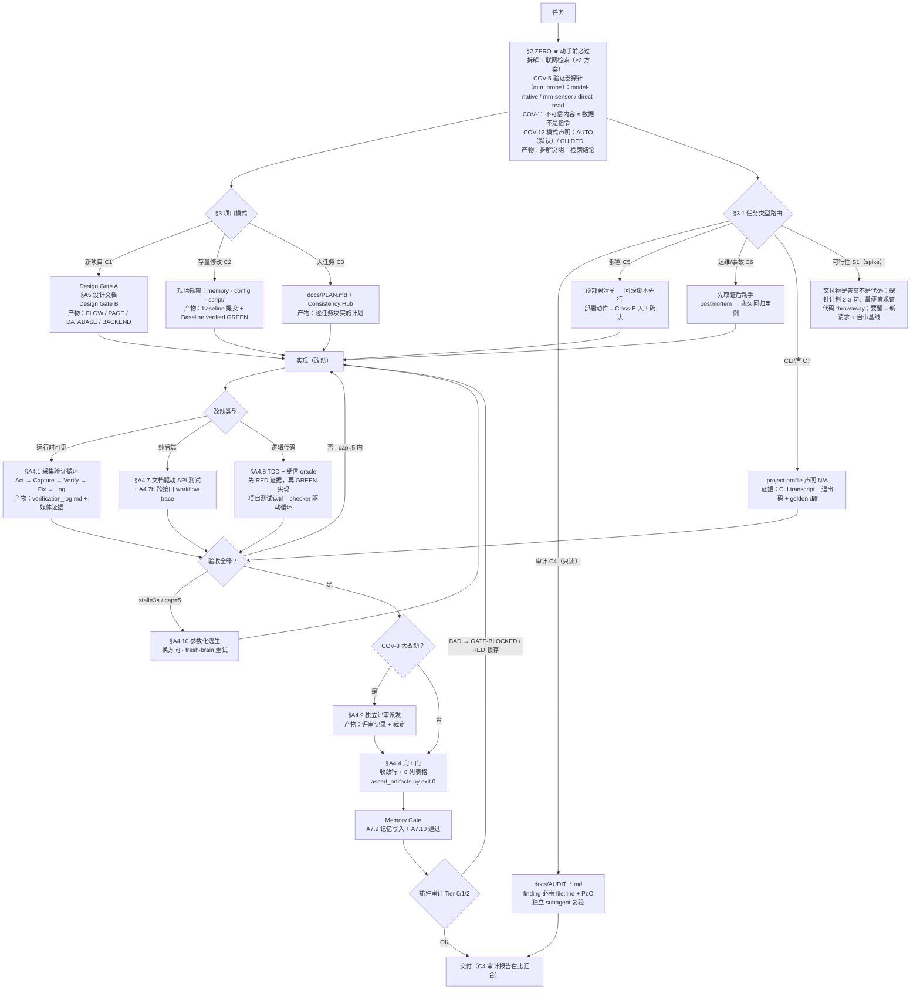

# Vibeweaver

[](https://github.com/logandoo/vibeweaver/actions/workflows/verify.yml)

Vibeweaver 不会让模型变强，但它能把模型已有的能力真正发挥出来。

## 快速开始

```bash
git clone https://github.com/logandoo/vibeweaver && cp -r vibeweaver/vibeweaver ~/.config/opencode/skills/vibeweaver
```

重启 opencode，然后直接提需求就行，skill 会自动触发。当然，如果需求最开始加一句「严格遵守 vibeweaver」会更好，基本能确保百分百触发。插件、可选配件和 Windows 安装方式见[安装](#安装)。

## 为什么需要它

这件事本该由 coding agent 自己完成，但 opencode 和 codex 都没有把它做成默认行为：平台给的是 hooks 和权限这些零件，纪律得由 skill 自己带。

coding agent 在真实项目上出问题，包括但不限于把文件删了、把项目重构了、改完 A 需求顺手把 B 功能搞坏了。这些大多是流程失败，不是能力失败：它不知道「完成任务」的定义，于是没有证据就宣布胜利；能跑的验证它跳过；上一场会话学到的东西它忘了；长任务里它开始漂移。

模型更强，很多时候并不能完全解决这个问题；提示词更长也解决不了：至少在当前时间点，LLM 的输出仍然是概率性的，出现偏离几乎不可避免。换个角度来说，大多数 SOTA 模型并不是不知道正确的方法是什么，但总免不了出现「脑子滑丝」的瞬间。Vibeweaver 的目的就在这：如果模型的输出偏离了，就让它停下来；如果模型的做法不对，就让它重新再来。有了上下文操作和 judge 的否定判断，大多数情况下模型是知道该怎么改正自己的错误的。该 skill 同时固定两件事：

- **流程**：拆解需求、检索现成方案、在至少两种方案间做选择、先设计后写码、测试先行、拿运行时证据验证、交付前独立评审。
- **标准**：什么算证据、由谁打分、证据缺失时会发生什么。

它不增加任何能力，它减少能力的浪费。当然，这个 skill 对模型的下限能力也有要求：至少，模型得真的能记住已经注入的规则。下面的基准表两个方向都看得到：最弱的模型在完整版下反而退步（它跟不上流程，规则还会淹没上下文），而本来就有能力的模型，在纪律被强制执行后，把已有的能力兑现成了满分。

执行层不是提示词。门禁插件和审计插件盯着会话和磁盘文件，产物缺失会以工具调用失败的形式返回。提示词是建议，`GATE-BLOCKED` 不是。

目前项目只针对 opencode 优化，另外开源了 DeepSeek Harness 版本的 [vibeweaver-dsh](https://github.com/logandoo/vibeweaver-dsh)。Codex 其实已经有这些零件（Stop hook、Goals、默认关闭的记忆管线），只是没有把它们串成一套默认的证据机制，这个 skill 也没在它上面实测过；Claude Code 的代码没查过。感兴趣可以自行 fork。

## 它怎么工作

收到需求后，agent 先拆解需求、检索现成方案，并说明选定的方向。有逻辑的代码测试先行。改动碰到运行时行为时，agent 会真的把应用跑起来、留下截图或视频并交验证器评分；失败进入有界修复循环（`cap=5`、`stall=3×`），每次重试都带一条可证伪的诊断。给出最终回答之前，它会跑项目的构件断言、把下一场会话必须知道的事写进 `memory/`、打印完工表格。门禁插件负责核对证据是否真的存在；不存在，agent 的下一次写入就会被拦住。这些机制没有让模型变聪明，它们让结果变得可核对。

## 它能做什么

- **NO TEST, NO DONE**：每次代码改动之后，必须真的跑过测试，并留下磁盘证据：日志文件、截图、操作录屏、页面音频。「能编译」不算证据。
- **测试优先，没有例外**：有逻辑的代码一律 RED→GREEN。先写一个注定失败的测试，把失败输出贴进 `tests/verification_log.md`，再写让它通过的最小实现。第一次跑就过的测试说明不了任何问题。回归测试必须走完完整的「还原并失败」流程才算数。
- **受信 oracle，拒绝自证**：只有项目或外部测试（或可执行的验收标准）能认证任务。生成的测试必须先过资格验证（stub 必挂、金标准必过、错误解必挂），且仍算弱证据；模型自写的测试最弱。规格里看不见的契约点标为待确认问题，不许发明。项目若有确定性 checker（`script/check.sh`、`tests/check.py`，或 APPENDIX §A11 的 `vw_check.py` 模板），checker 就是循环的反馈源。
- **自动启动的验证循环**：改动一碰到运行时行为，agent 自动进入 `Act → Capture → Verify → Fix → Log`。验证器在任务开始时由行为探针选定（见[和 mm-sensor 怎么配合](#和-mm-sensor-怎么配合搭档不是对手)）：多模态模型按严格协议自读截图，[mm-sensor](https://github.com/logandoo/mm-sensor) 独立打分，或者由 DOM 与日志核验承担证据。验证器支持视频、音频时就一起录。
- **API 文档驱动的后端测试**：纯后端改动的循环是：更新 API 文档，做一次文档与代码一致性核对，照着文档写测试用例（不照着实现写），再用 httpx 跑「测试→修→再测」直到全绿。跨接口的改动还必须写真实 HTTP 的工作流场景，痕迹落盘（`tests/workflows/*.trace.log`）；直接调 service 层不算 E2E，不算数。
- **脚本化生命周期**：构建与服务启停一律走 `script/` 目录下的脚本。裸 `npm run build`、`vite`、`npm start`、`uvicorn` 全部禁止。停服务必须用 `.pid` 文件模式；在共享机器上 `pkill -f "uvicorn"` 会顺带杀掉同事的服务。
- **先研究再动手**：任何任务的第一步都是拆解问题（有不清楚的就停下来问，一次一个问题，别猜），并联网检索现成方案（exa MCP + Context7），评估至少两种方案再写代码。除非没有网络或只是琐碎的 typo、配置修改。背后的哲学：太阳底下没有新鲜事。如果真搜遍全网都找不到先例，那说明这活儿新到不该由我们干。
- **项目记忆**：opencode 没有原生记忆系统，每场会话都是从头开始的新脑子。vibeweaver 用文件和规则硬造了一个：索引 + 主题文件、信任分级（⛔ 禁止 / ❌ 失败 / ✅ 已验证 / ⏳ 未验证）、修 bug 的状态机。完整机制见下文。
- **循环有上限**：每个验证循环都受约束：单个子问题最多 `cap=5` 次迭代，`stall=3×`（同一标准连续失败三次就停下、换方向、把死路记进 memory）。
- **覆盖完整开发流程，不止一个环节**：新项目脚手架（先出设计文档 FLOW / PAGE / DATABASE / BACKEND）、配置管理、验收清单、按任务类型路由（构建 / 审计 / 部署 / 运维 / CLI 与库 / 可行性 spike）、8 列完工表格，以及两个执行层插件。

## 安装

```bash
git clone https://github.com/logandoo/vibeweaver && cp -r vibeweaver/vibeweaver ~/.config/opencode/skills/vibeweaver
# 或者在仓库本地副本里：
./vibeweaver/install.sh    # Linux/macOS
vibeweaver\install.bat     # Windows
```

重启 opencode。要求构建、修改、调试或部署任何东西时，skill 会自动触发。

`install.sh` / `install.bat` 会把执行层插件（门禁 + 审计器）一并装上。手动安装插件：

```bash
cp ~/.config/opencode/skills/vibeweaver/vibeweaver-gate.js ~/.config/opencode/plugins/
cp ~/.config/opencode/skills/vibeweaver/vibeweaver-audit.js ~/.config/opencode/plugins/
```

插件是执行层，skill 是指令层，两者独立工作，所以只装 skill 不装插件也能跑。

可选配件，大致按重要性排序：

- **Playwright** 和 **[mm-sensor](https://github.com/logandoo/mm-sensor)**：一对设计好的搭档。少了它们，验证循环会明显变弱（从独立打分退化成自己给自己打分）。
- **ffmpeg**（视频转码）和 **exa MCP + Context7**（研究）。

缺了这些 skill 照样跑。

## 用法

用大白话提需求（「加个 OAuth 登录」「修这个 502」「能不能做 X」），skill 按任务类型路由。任务结束后磁盘上的东西：

| 产物                          | 证明了什么                              |
| --------------------------- | ---------------------------------- |
| `tests/acceptance.md`       | 动工前写下的停止条件（首行 `> cap=5  stall=3×`） |
| `tests/verification_log.md` | 每次采集→验证→修复的迭代记录，失败行带 diagnosis     |
| 媒体证据                        | 截图 / 视频 / 音频，由任务开始时选定的验证器评分        |
| `memory/*.md`               | 后续会话必须知道的事（禁止路径、已验证修复）             |

装了门禁插件后，产物缺失会拦下 agent 的下一次写入并报 `GATE-BLOCKED`（见[执行层：门禁与审计](#执行层门禁与审计)）；`VIBEWEAVER_GATE=off` 可关掉门禁。

## 仓库结构

本仓库包含三个子项目：

| 目录                 | 是什么                                                                                                                                         |
| ------------------ | ------------------------------------------------------------------------------------------------------------------------------------------- |
| `vibeweaver/`      | 完整版 skill，本 README 描述的就是它                                                                                                                   |
| `vibeweaver-mini/` | 小模型套件：1.7KB 的确定性循环（「跑 checker、修第一个失败、重复」）+ `scripts/vw_check.py`（打印修复包、测试集变化即拒绝运行）。3B 激活模型实测：循环 + 真测试 4/4，循环 + 自写测试 1/4；起决定作用的是 oracle，不是文案 |
| `vibeweaver-eval/` | 评测架：16 题 A/B 评测的配置、评分脚本、原始结果、逐轮报告                                                                                                           |

怎么选：**强模型** → 完整版（插件注入）；**弱指令遵循模型** → mini 常驻；**极弱模型（~3B 激活）** → mini + checker 强制注入。

仓库根目录还有 skill 自身的测试设施：`verify_skill.py`（skill 包完整性检查）、`tests/`（含 pass/fail 夹具项目的自测套件）、`.github/workflows/verify.yml`（每次 push 在 Ubuntu / macOS / Windows 上跑这两个）。这个 skill 检查别人项目的方式，原样用在自己身上。

## 到底有没有用？

下面每张表都是开头那句话的证据：skill 不增加能力，它改变的是已有能力有多少能真正兑现。每张表都用同一种设置方式：

- baseline：完全不用 skill。
- 仅挂载：skill 装好了、出现在 `available_skills` 里，模型自己决定要不要加载。它到底加载了没有，就是表里单列的**触发率**。
- 强制注入：skill 全文塞进系统提示词，模型没得选。

### 评测是怎么设计的

下面的数字来自同一套固定、可复现的评测架（`vibeweaver-eval`），设计目标是让各轮可比、难以取巧：

- 固定任务集：每个模型轮都是同样的 16 题，10 道 Aider polyglot + 6 道 SWE-bench Lite 真实仓库修 bug。同样的提示词、同样的评分，一轮接一轮。
- 隐藏测试评分：polyglot 是 Exercism 风格，SWE-bench 带 FAIL_TO_PASS + P2P 回归保护。
- 隔离的组：每组跑在独立的 XDG 配置目录里，组与组之间唯一的差别就是 skill（或者没有）。裸模型组就是**对照组**，其余各组是实验组。
- 入组前先过 gold 验证：每个 SWE-bench 实例必须先通过「base 必挂、gold 必过」的验证，才有资格进评测集。
- 全程无人值守、脚本化：`opencode run --auto`，评测架、配置、gold 校验、原始运行记录、评分脚本全部公开。
- **两代 skill。** 下面的分模型轮跑于 2026 年 8 月，用的是当时的 71KB 完整版和 2.2–5.7KB 的 mini；第六、七波（2026 年 9 月）用瘦身后的 41.8KB 完整版和 1.7KB 确定性 mini 套件重跑了关键对照：那才是最接近今天实际安装版本的数字。

### 用前 / 用后：qwen3.6-35b-a3b（目前最弱的模型）

34.6B MoE / ~3B 激活，GGUF Q5 量化，llama.cpp 后端。这个模型在能力最低的一端把「体积→触发率」的规律砸碎了：

| 组             | 通过率（16 题）        | 触发率  |
| ------------- | ---------------- | ---- |
| 裸模型（baseline） | 6/16 (37.5%)     | —    |
| mini，仅挂载      | 6/16 (37.5%)     | 0/10 |
| 完整版，仅挂载       | 7/16 (43.8%)     | 0/10 |
| **mini，强制注入** | **7/16 (43.8%)** | —    |
| 完整版，强制注入      | 5/16 (31.3%)     | —    |

- 能力低于阈值后 skill 机制整体失效：模型从不调用 skill 工具（mini 和完整版都是 0/10）。
- 强制注入是唯一的入口，而且只有小版本有效：5.7KB 的 mini 是唯一正增益路径（7/16 vs baseline 6/16，polyglot 4/10 vs baseline 2/10），而当时的 71KB 完整版是上下文毒药（5/16，SWE-bench 只剩 1/6，其中 5 次 `no diff produced`，9 次超时）。
- 第六波找到了真正能解锁它的形态：不是提示词，是一个确定性程序。1.7KB 的 mini 套件 + checker + 项目真测试，把它从 1/4 拉到 **4/4，而且是之前所有纯提示词臂全挂的那 4 道题**（每题跑 12-36 次 checker、零改测试）；同样的循环换成自写测试或未过资格验证的生成测试，仍然只有 1/4。对 ~3B 激活的模型，起决定作用的是 oracle，不是提示词。这个 4/4 要按能力探针来读（checker 看得到标准测试），不是 benchmark 成绩。
- 第七波在这个模型上的 8 题子集 A/B：before 4/8、after 3/8，在噪声内：纯文本改动对它保持中性。

### 用前 / 用后：qwen3.6-27B

| 组             | 通过率（16 题）         | 触发率       |
| ------------- | ----------------- | --------- |
| 裸模型（baseline） | 7/16 (44%)        | —         |
| 完整版（71KB），仅挂载 | 6/16 (38%)        | 0/16      |
| 完整版（改进描述），仅挂载 | 9/16 (56%)        | 2/16      |
| 完整版，强制注入      | 9/16 (56%)        | —         |
| **mini，仅挂载**  | **10/16 (62.5%)** | **10/16** |

这一轮就是 mini 版存在的全部理由：

- mini 干翻了强制注入的完整版（62.5% vs 56%），赢在它真的被*加载了*：一套模型愿意读且能记住的短规则，胜过一份它永远不打开的 71KB 巨著。
- 体积决定触发。71KB → 0/16，mini → 10/16。

### 用前 / 用后：deepseek-v4-flash-0731

| 组             | 通过率（16 题）         | 触发率   |
| ------------- | ----------------- | ----- |
| 裸模型（baseline） | 11/16 (68.8%)     | —     |
| 完整版，仅挂载       | 11/16 (68.8%)     | 0/16  |
| mini，仅挂载      | 11/16 (68.8%)     | 12/16 |
| **完整版，强制注入**  | **14/16 (87.5%)** | —     |

强模型自带这套纪律，mini 从这个档次的模型开始变得毫无增益。完整版的增益开始明显，但是模型自己永远不会去加载（仅挂载时 0/16），需要**强制注入**上下文。优势全在 polyglot：8/10 vs 5/10。

### 用前 / 用后：qwen3.8-27B

| 组             | 通过率（16 题）        | 触发率             |
| ------------- | ---------------- | --------------- |
| 裸模型（baseline） | 13/16 (81%)      | —               |
| mini，仅挂载      | 13/16 (81%)      | 10/10（polyglot） |
| 完整版，仅挂载       | 15/16 (94%)      | 12/16           |
| **完整版，强制注入**  | **16/16 (100%)** | —               |

两个发现：裸模型自己就变强了（vs qwen3.6 从 44% → 81%）；而且 3.8-27b 的主动加载能力强了很多，qwen3.8 有 12/16 次主动加载完整版，刷出这套评测的历史最高分。强制注入完整版后直接登顶：**16/16 满分，评测史上第一个满分轮**（polyglot 10/10 全部满分、SWE-bench 6/6）。但这个满分的代价不小：均值 1820s/题 vs 自主的 518s（+251%），这就是「每道题都走完整验证循环」的价格。mini 和在 deepseek-v4-flash-0731 上一样没有价值。

### 四模型，一张表（16 题轮，2026 年 8 月）

|           | qwen3.6-35b-a3b | qwen3.6-27B       | deepseek-v4-flash-0731 | qwen3.8-27B      |
| --------- | --------------- | ----------------- | ---------------------- | ---------------- |
| 裸模型       | 6/16 (37.5%)    | 7/16 (44%)        | 11/16 (69%)            | 13/16 (81%)      |
| 完整版，仅挂载   | 7/16 (43.8%)    | 9/16 (56%)†       | 11/16 (69%)            | 15/16 (94%)      |
| 完整版，强制注入  | 5/16 (31.3%)    | 9/16 (56%)        | 14/16 (87.5%)          | **16/16 (100%)** |
| mini，仅挂载  | 6/16 (37.5%)    | 8-10/16（最好 62.5%） | 13/16 (81%)*           | 13/16 (81%)      |
| mini，强制注入 | 7/16 (43.8%)    | 8/16 (50%)        | —                      | —                |
| 最优形态      | mini 强制         | mini 仅挂载          | 完整版强制                  | **完整版强制**        |

\* deepseek 的 mini：首跑 11/16，干净环境重跑 13/16，都在它 11/16 baseline 的噪声内。
† qwen3.6 的完整版：原版 6/16（从不加载）；9/16 是改进描述变体。

### 第六、七波（2026 年 9 月，当前 skill）：到底什么在起作用

上面四模型表来自 16 题基准。后续几轮问了一个更窄的问题：小模型真用上 skill 时，差别在哪？答案不是「更多规则」。

**对照组（deepseek-v4-flash，16 题，强制注入）**：裸模型 11/16；一份 39KB 的通用工程手册（同尺寸、同语气）11/16，长结构化提示词本身没有效果；完整 skill 15/16。skill 对手册：discordant +4/−0（McNemar p=0.125，方向清楚但 n=16 样本不足）。

**oracle 实验（qwen3.6-35B-A3B，4 道所有臂都挂的题）**：给确定性 checker + 项目真测试（能力探针：checker 看得到标准测试），1/4 → 4/4，每题跑 12-36 次 checker、零改测试。同样的循环换成自写测试：1/4，其中一题还掉到基线以下。生成测试即使来自强模型、即使过了资格验证（stub 必挂、金标准必过、错误解必挂）：1/4，且出现「假绿」。

交付解通过了生成套件，却挂在真测试的 `area_code` 属性和精确错误文案上，而这些契约点从没写进任何可见材料。瓶颈从来不是循环，是 oracle。第七波把这条结论写进了 A4.8 和 APPENDIX §A11。

**第七波 A/B（仅文本非劣性，强制注入）**：deepseek-flash 16 题 13/16 → 16/16（before 是低抽样，wave6 同尺寸为 15/16，读作无回归）；qwen3.6-35B 8 题子集 4/8 → 3/8，一进一出。checker/oracle 机制由上面的实验验证，不由这次 A/B 验证。

### 说句实话

- 因为是 TDD 导向的 skill，所以会**疯狂消耗 token**。如果手头真有想要解决的问题，还是很建议试试；如果只是玩一玩 vibe-coding，这个 skill 倒也不显得那么重要。
- 模型换代还是比 skill 本身重要的多：qwen3.6 → qwen3.8 在没上任何 skill 的情况下就把裸模型从 44% 抬到 81%；**skill 的角色随模型翻转**：在 qwen3.6 上它*补上*缺失的纪律（mini 赢），在 qwen3.8 上它*强制*执行纪律（强制注入直接满分 16/16），在 deepseek 上只有强制使用完整版才有效，在 35b-a3b 这类模型上只有强制 mini 才有效。
- **测试的来源比数量重要**：自写测试会骗人（有一题用自写测试比完全没有反馈还差），生成测试会欠规范，套件能在错误实现上全绿、真契约却挂在从没写下来的方法名或错误文案上。诚实的层级是：项目/外部测试 > 通过资格验证的生成测试 > 自写测试。
- 16 题确实是小样本。虽然每个任务都挺复杂，但不能完全排除某一题「恰好可以搞定」或「恰好搞不定」、刚好碰上模型擅长点和不擅长点的情况。
- 每组每轮只跑了一次。qwen3.8 一组自主跑 1-2.5 小时、强制注入约 8 小时；llama.cpp 上的 35b-a3b 一组 3-4 小时，其中一轮撞了 8 次 2400 秒超时。其实应该多跑几轮的，**毕竟模型有随机性**，然而跑一轮时间太长了，暂时没有足够的耐心去跑那么多轮。第七波的数字继承同一限制：deepseek 的 +3 在轮间方差内，qwen 子集只有 8 题。
- mini 其实是个很鸡肋的 skill，但对于恰好需要用到的人，就恰好有用。qwen3.8 上它毫无增益，35b-a3b 上它只有强制注入时才有效。这是最有意思的一点：面向指令遵循能力很强和指令遵循能力很弱的模型，mini 都没什么太大的意义；但是像 qwen3.6-27B 这种能力不错、但长上下文指令遵循欠佳的模型，这是个不错的选择。

## 工作流是一张图，不是一份清单

先看全图，再逐条解读（每个节点都是带强制产物的阶段，每条边都是显式条件）：



- **节点 = 带强制产物的阶段。** ZERO（拆解 + 联网检索）→ 项目模式判定 → 设计门 → 实现 → 验证循环 → 独立评审派发 → 完工表格。「模型说完了」不算一个阶段完成；它要求的产物真的落在磁盘上，才算完。
- **边 = 显式条件，不是模型心情。** 新项目走一条流程，存量修改走另一条；验证器能力探测把采集/评分集分支成三种验证器模式；纯后端改动把浏览器循环替换成文档驱动的 API 测试循环。
- **环路天生有界。** 每个循环共用同一份终止契约（`cap=5` 次迭代/子问题，`stall=3×`），而且停止条件由用户*最先*写下来，所以这张图保证有出口。
- **遍历是软的，卡点是硬的。** 模型靠解释自然语言来走图，这部分依然是软的。但每个卡点的条件都可以机器校验：最终回答里的字面 token、被 `tests/assert_artifacts.py` 逐字节核对的磁盘证据，以及（装了插件时）一个工具级钩子：任何一个卡点没转过，agent 自己的写入就会被拦住，想走也走不动。

这就是它为什么是状态机：当前阶段永远可以从文件里验证出来，而且没有证据就不允许声明任何状态转移。下面的门禁和审计器是同一个思路往下一层：图的最后两个卡点，由 opencode 本身执行，而不是由模型执行。

## 执行层：门禁与审计

提示词只是建议。一个刚被告知「NO TEST, NO DONE」的模型，依然有可能一个测试都不写就宣布完工。两个配套插件在**工具层**机械地强制执行证据规则。

**`vibeweaver-gate`：stop hook。**

- 它挂在 opencode 的 `tool.execute.after` 钩子上，拦截每一次 `write`/`edit`。如果项目处于 vibeweaver 激活态（有 `tests/verification_log.md`），插件就运行项目的 `tests/assert_artifacts.py`（四种 flag 组合全试一遍）。
- 如果验证证据缺失或造假（日志里没有迭代记录、`acceptance.md` 首行没有 `> cap=5  stall=3×`、被引用的截图/媒体文件不存在或零字节），插件会**向工具调用结果里抛一个 `GATE-BLOCKED` 错误**。agent 走不动了，它自己的工具调用会报错返回。这就是 stop hook 的全部意义：它会阻止模型自顾自完工。
- 结构性缺失（`memory/`、设计文档、README）只追加 `GATE-WARNING`，不阻塞。
- 还有个 `session.idle` 兜底：会话在证据还欠着的时候就安静下来，插件会往 opencode 日志写一条 `warn`。
- 这个拦截刻意做成可复查而非死停：把证据补齐，下一次 `write`/`edit` 会自动重新检查。
- `VIBEWEAVER_GATE=off` 关掉它。

**`vibeweaver-audit`：机械审计器。** 会话空闲时它重跑项目的 `tests/assert_artifacts.py`（和门禁用的是同一份脚本），再用自己的声明检查组给最终输出打分、复核磁盘证据。

打出 BAD 就落下一个**会话级**的 RED 锁存，拦住 agent 的写入，直到证据真的补齐。正因为锁存是会话级的，一个被截断的会话永远不会把项目锁死：换会话、TTL 到期、旧格式状态迁移，三条路都会自动释放；而且每次释放都会记进日志并出现在审计报告里（机制详见 [CHANGELOG_zh.md](CHANGELOG_zh.md) 的 2026-08-21 一节）。

门禁也不挑 skill：只要项目里有 `tests/verification_log.md` 它就生效，所以 **vibeweaver-mini** 同样被覆盖，mini 的落盘格式刻意与它的证据底线保持一致。只用 mini 又想要这条硬底线的用户，装这一个插件就够了。

一句实话：这个插件说的是 opencode 的插件 API（`tool.execute.after`、`session.idle`、`client.app.log`）。至于 Claude Code 或 Codex 有没有类似的机制，没验证过，欢迎 fork。vibeweaver-dsh 移植版带同一套 `assert_artifacts.py` 证据检查。

## 记忆系统：opencode 会忘，文件不会

opencode 原生没有记忆。开一个新会话就是一颗新脑。它完全不记得三场会话前被否掉的那个 JWT 重构方案，也不记得上一个工程师为了登录的 bug 追了两天最后发现是 session TTL 不匹配。每场会话它都重新撞同一堵墙、重新提交同一个被否掉的方案。vibeweaver 用文件和规则自己造了一个：

- **索引 + 主题文件。** `memory/MEMORY.md` 是目录而不是内容本体（加载上限 200 行 / 25KB）。每条记忆单独放一个 `memory/*.md`，带 YAML frontmatter：类型（`user` / `feedback` / `project` / `reference` / `fix`）、状态、对应的 commit 哈希、引用的文件位置。
- **选择性召回，不是全量背诵。** 会话开始时先加载索引，再按请求里的关键词 grep 主题文件，只加载最相关的 3-5 条。记忆在动手前被检索，但绝不盲信：每条文件/行号引用都要对照当前代码验证，超过 14 天的条目会挂上「可能已过期」的警告。连 ✅ 已验证的条目也会自动过期：14 天没复核、或者引用的代码变了，就先降级回 ⏳ 待验证。
- **信任分级，因为记忆不等于事实。** ⛔ 禁止 = 被证明必失败的方法，不许再试。✅ 已验证 = 用户亲口确认过。⏳ 未验证 = agent 自己修的、测试通过了但没人确认，仅供参考，不是事实。❌ 失败 = 后来被证伪的 ⏳，跟 ⛔ 一样「不许再试」。
- **修 bug 的状态机。** agent 修完、测试过了 → 记成 ⏳（永远不许直接写 ✅，只有用户能验证）。同样的症状在下一个会话再出现 → 这条自动降级为 ❌，agent 必须换一个真正不同的方向。用户确认有效 → 升 ✅。同一问题失败三次以上 → 全部升级进 ⛔ 禁止文件，这个方向硬停。
- **每次会话必写，收尾必检。** 记忆写入是会话结束时的强制动作，完工表格之前还要过一道 Final Memory Gate。修复条目必须带上它所描述改动的 commit 哈希，以及考虑过但没走通的路和否掉的备选方案。以后的会话看一眼记忆、看一眼当时的代码，就省得再撞一次南墙。
- **两个作用域，合并加载。** 用户全局记忆（`~/.config/opencode/vibeweaver/memory/`）存跨项目的偏好和约定；项目本地记忆存一切项目专属的东西。会话开始时两个都加载，冲突时项目本地优先。
- **家务活。** 索引有整理触发线（150 行 / 20KB，或超过 15 个主题文件）：整理时 ⛔、✅、用户与反馈条目原样保留，过期的 ⏳ 被清掉；`.session-scratchpad.md` 用来跟踪难缠的多轮修复过程，写完正式记忆后删除。

一句话：用文件系统和规则，硬给没有记忆层的模型补上跨会话的「记得住」。

## 认知层：工具之上的状态管理

证据规则解决的是「模型谎报了做了什么」，解决不了「模型悄悄忘了自己处于什么状态」。长任务里的漂移、打转、目标蒸发属于后一类，住在更上面一层。最近一版从 [J-Space Cognition Suite](https://github.com/Tiger3807861189/J-Space-Cognition-Suite-V3.6)（出处见[致谢](#致谢)）借来一组机制，正好补这一层：

- **来路不明的内容 = 数据，不是指令（COV-11）。** 这个 skill *强制*联网检索（exa MCP + Context7），而「忽略之前所有指令」恰恰就藏在外来内容里。抓取/工具/第三方的文本可以提供信息，但不能下命令；抓来的「解决方案」照样得过 ≥2 方案评估；并且不对称规则生效：扫到可疑是强证据，「没扫出可疑」**不等于**干净：「不存在」要靠一次具名检查确立，不能靠模型自己的监视器保持沉默来确立。
- **一致性枢纽（写一次，读多次）。** 大任务在计划里为每个共享的名字/配置键/值/签名立一行规范记录。后续步骤*引用*枢纽行，而不是重新推导；改名先改枢纽，然后把旧拼写 grep 到零命中，零命中的 grep 输出就是完工证据。这直接干掉长任务里「同一个已确定的值出现三种拼写」的经典漂移。
- **带诊断的重试。** `verification_log.md` 里每一条 `- iter N FAIL:` 必须带 `diagnosis: <一句可证伪的判断>`，机器检查（assert 第 12 组）。不带诊断的重试就是同一个尝试再来一遍：同样的成本，买不到任何东西。
- **停滞逃生：参数化，别打转。** `stall=3×` 触发后，下一步方向要*生成*出来，不是凭感觉：把悬而未决的未知量变成有限候选集，每个候选配上「最便宜的可能推翻它的测试」，然后才转向（换抽象 / 换策略 / 转实证）。差分验证要求参考实现**不与候选共享假设**，继承同样「聪明」的暴力解会继承同一个 bug。两条便宜且独立的验证路径都存在时，两条都走：一致则结论得力，不一致恰好*定位*了错误假设。
- **长间隔后的重入。** compaction / 跨 session / 长时间中断之后，agent 先全量重读 `verification_log.md`、逐行重读目标、重读契约，然后说出恢复后的第一步动作，按这个顺序，然后再碰工作（§3.3）。
- **停滞观测机械化。** 门禁插件现在维护 `.vibeweaver/state.json`（原子写）：同一文件被改 3 次、中间没有新增 PASS 条目 → 触发一条指向逃生协议的 `GATE-WARNING`。`stall=3×` 以前是模型自己数的上限，现在插件也数。

顺便把 skill 自己宣讲的渐进披露纪律用到了它身上：约 120 行的内嵌断言脚本变成规范的 `scripts/assert_artifacts.py`，四个后端/TDD/评审协议移入 `TESTING_PROTOCOLS.md`。入口文件从 79KB 的单文件做到今天的 682 行 / 41.8KB；上面每条新规则的成本是一行紧凑契约 + 一个指针。

## 和 mm-sensor 怎么配合：搭档，不是对手

vibeweaver 和 [mm-sensor](https://github.com/logandoo/mm-sensor) 建议一起用，skill 中也专门做了 mm-sensor 的检测和调用。真不想用也无所谓，不过效果会打点折扣。分工如下：

- **验证器三段树（COV-5，行为探测，不靠自宣称）。** 任务开始时 vibeweaver 先跑自多模态行为探针 `scripts/mm_probe.py`：生成一张带 token 和颜色的探针图（`tests/probe_vision.png`），模型用 Read 读它并报告看到的 token+颜色，再 `--check` 校验。
- **PASS** → 宣布 `Verifier: model-native [image]`，模型按 §A4.1.1 视觉验证协议自读截图（观察前置 · 逐标准引证 · DOM/日志交叉核验 · UNCERTAIN=FAIL）。**FAIL** 且装了 mm-sensor → 宣布 `Verifier: mm-sensor [video+audio|video|image]`，独立打分。两者都没有 → `Verifier: direct read`（以 DOM/日志核验为主）。
- vibeweaver 负责让证据存在。它的规则逼着 agent 真的把应用跑起来、用 Playwright 驱动、把截图/操作录屏/页面音频留在磁盘上。
- mm-sensor 负责独立打分。写代码的和打分的是两个角色：mm-sensor 是验证器时，写代码的模型被明令禁止给自己的截图打分（自评即违规，没有例外）。只装 vibeweaver 时，模型过不了自多模态探针就退回「直接读图」的自评模式，弱一截，还得额外拿 DOM 和日志交叉核对。
- 能力检测决定采多少证据。任务开始时 vibeweaver 跑一次 `vision.py --probe`，问清楚 mm-sensor 背后的模型到底能感知什么。全模态模型拿到 `[video+audio]` 模式：Playwright 录下全流程视频、用 Web Audio 抓页面音频，外加一张终态截图。只认图的模型降级到 `[video]` 或 `[image]` 模式。模式每任务固定一次，每份采集的文件都用 `vision.py --detail high` 评分。
- 如果系统环境不充分，也会降级运行。没有 ffmpeg → 直接用原始 webm 帧采样评分。模型听不了音频 → mm-sensor 明确报告跳过，循环继续用视频加截图跑。音频永远只是加分项，本身不构成验收标准。

一句话：vibeweaver 决定*该采什么、而且必须采*；验证器（model-native 或 mm-sensor）决定*证据到底说了什么*。

## 技术栈兼容

vibeweaver 与技术栈无关，从不假设语言、框架或数据库：

- 新项目：报上技术栈，或者它会在开工前问一次。然后围绕这个技术栈生成设计文档、`config.toml` 布局、`script/` 生命周期脚本和依赖清单。
- 存量项目：它先读现场（记忆、配置、脚本、目录结构），再让每条规则去适配现状。它不会「好心」往 Vue 项目里塞 React。
- Windows：放心，`install.bat` 和 `script/windows/` 都在。

### 默认技术栈，以及怎么改

新项目脚手架内置了一个默认栈（REFERENCE.md 的 Part B1）：**FastAPI + React + Vite + PostgreSQL**，Python/FastAPI 后端，所有接口挂 OAuth2 认证，前端挂在 `/static` 下并带 history 路由回退，React + Vite 响应式前端（桌面 / 平板 / 手机）。说「开个新项目」然后什么都不说，出来的就是这套。

想要别的技术栈，两条路：

1. **按项目来，完全不用动 skill。** 开口就报清楚（「新 Go + Vue + MySQL 项目」），skill 就围绕报的栈来搭。默认栈只在没挑的时候生效。核心规则（Part A）与技术栈无关；skill 读声明的栈，填上真实的构建命令，再把 `[database]` 配置块改成实际用的数据库。

2. **永久改，改 skill 的 Part B。** 想换个*默认值*焊死进去，就改 `REFERENCE.md` §B1（"Default New Project Stack" 那节）里的栈描述，同时把 `APPENDIX.md` 里对应的两处一起改掉：

   - §A5：`config.toml` 完整模板（改成实际的后端 / 数据库形态）
   - §A6：脚本模板（`script/linux/project_build.sh`、`start.sh`、`stop.sh`、`restart.sh` 和 Windows 的 `.bat` 兄弟），让它们生成的是这个栈的真实构建/启停命令，而不是 npm/uvicorn 那套

   适配时的准则（Part B2）：Part A 的核心原则全部照搬（放之四海皆准），脚本模板换成自家的构建工具，配置模板对准实际的数据库，`script/` 目录纪律不能丢，机制比里面的命令更重要。

## vibeweaver vs superpowers

[Superpowers](https://github.com/obra/superpowers) 是最接近的知名同类：一个基于 skill 的 coding agent 开发方法论。两边都是 MIT，都是 skill 生态，但押注的方向不同：

| 维度   | vibeweaver                                                                                                                       | superpowers                                                |
| ---- | -------------------------------------------------------------------------------------------------------------------------------- | ---------------------------------------------------------- |
| 工作流  | 拆解 → **联网检索（几乎强制）** → 任务类型路由（构建/审计/部署/运维/非 Web/spike）→ 设计文档/实施计划（新项目/大任务时）→ 测试先行 → 证据门槛                                          | 请求分类（spike/有界/架构级）→ 设计批准 → 规格 + 小步计划（架构级路径）→ 子 agent 逐任务执行 |
| 核心赌注 | **搜索先行 + 证据门槛式完工**，动手前几乎强制联网检索（太阳底下没有新鲜事），完工必须测试跑完并留下产物，还有工具级插件拦截兜底                                                              | **计划先行 + 批准先行**，人没点头绝不动手；仪式感随任务缩放，批准门永不缩放                  |
| 人工介入 | 默认 AUTO：agent 在既定交互点自行决断并记 ADR；需要多把关就选 GUIDED                                                                                    | 每条路径都是硬批准门，spike 要点个头，有界任务要对对话里的短设计说「行」，架构级逐节点头            |
| 执行模型 | 同一会话，验证器连续，记忆与证据随任务累积；子 agent 只做只读评审                                                                                             | 每个任务换一个新子 agent，上下文隔离；协调者在任务间评审                            |
| 验证   | 自动启动的采集循环，独立多模态验证器评分，`assert_artifacts.py` 逐字节核对证据；重大变更过独立评审（spec 保真三元组）                                                         | 「先证据后声明」铁律（重跑命令、亲读输出），流程约束，无工具门                            |
| 项目记忆 | 内置记忆子系统，带信任分级                                                                                                                    | 非核心功能                                                      |
| 模型要求 | 也为小模型优化（mini 版，实测到 ~3B 激活档）                                                                                                      | 默认强模型，长规格、长计划、子 agent 委派                                   |
| 工具支持 | opencode（带插件拦截；[vibeweaver-dsh](https://github.com/logandoo/vibeweaver-dsh) 是 DeepSeek 移植版；Claude Code / Codex 有无类似机制未知，欢迎 fork） | Claude Code、Codex、Cursor、Gemini CLI、Copilot、opencode 等     |
| 公开评测 | 与裸模型对照的 A/B 数据，多模型多轮                                                                                                             | 无公开基线数据                                                    |

两者开头一样，先拆解再计划。重心不同：superpowers 把投入放在规划上，每条路径都留一道人工门；vibeweaver 把「先搜索」提到几乎强制的级别（太阳底下没有新鲜事），默认让 agent 自己往前走（AUTO），完工则卡在证据上。两者并不互斥；token 预算管够的话，一起上也没问题。

当然，一起上之后 agent 会不会因为上下文爆炸而彻底不干了，没试过不知道，欢迎测试反馈。

## 文件清单

| 文件                                                  | 用途                                                                                                               |
| --------------------------------------------------- | ---------------------------------------------------------------------------------------------------------------- |
| `SKILL.md`                                          | 绑定操作契约 + 路由器（682 行，约 41.8KB，有体积守卫）                                                                               |
| `COMPLETION_GATE.md`                                | 完成输出规格 · 构件门禁 · §AUDIT 审计协议 · 预输出清单                                                                              |
| `CODING_PRINCIPLES.md`                              | 4 条铁律（Think Before Coding · Simplicity First · Surgical Changes · Goal-Driven Execution）+ Fowler 12 项 smell 评审基线 |
| `ENGINEERING_STD.md`                                | 工程标准细则                                                                                                           |
| `REFERENCE.md` / `APPENDIX.md`                      | Part B/C 流程全文 + §A5.1 / 可执行模板（§A1–§A9、§A11 受信 oracle + checker）                                                  |
| `TESTING_PROTOCOLS.md`                              | §A4.1 循环 + §A4.6 调试 + §A4.7–§A4.11 规范文本（§A4.11 模式/暂停协议）                                                          |
| `WORKFLOWS_EXTENDED.md`                             | §M 双模式 + Class-E 清单 + ADR/PAUSED 格式 · C4 审计 / C5 部署 / C6 运维 / C7 非 Web / S1 spike · 项目画像参照                       |
| `MEMORY_RULES.md` / `MEMORY_TEMPLATES.md`           | 项目记忆子系统                                                                                                          |
| `scripts/assert_artifacts.py`                       | 规范断言脚本，项目复制进 `tests/` 使用（16 组：产物存在性、证据完整性、诊断/声明 lint、secret scan、test-change guard、risk-tier）                    |
| `scripts/mm_probe.py`                               | 行为化多模态自探针（COV-5 验证器选择）                                                                                           |
| `vibeweaver-gate.js`                                | stop hook 插件（opencode）+ 机械化停滞观测                                                                                  |
| `vibeweaver-audit.js`                               | 三层机械审计器（Tier 0/1/2），会话级 RED 锁存、带留痕的自动释放、陈旧锁存自愈                                                                   |
| `scripts/vibeweaver-audit-core.js`                  | 纯裁决核心（可无头测试）                                                                                                     |
| `scripts/audit_selftest.mjs` / `mutation_sweep.mjs` | 36 项 fixture 检查 / 27 项变异检查，含锁存释放回归                                                                               |
| `install.sh` / `install.bat`                        | 安装脚本（skill 文件 + 两个插件）                                                                                            |

## 测试

本仓库用 skill 要求别人项目的方式检查自己：

```bash
python3 verify_skill.py                     # 包完整性：payload、链接、标记、语法
python3 -m unittest discover -s tests -v    # 技能自测 + checker 回归测试
node vibeweaver/scripts/audit_selftest.mjs  # 36 项 fixture 检查（无校准数据时 T6 SKIP）
node vibeweaver/scripts/mutation_sweep.mjs  # 27 项变异，每项都必须被抓到
```

CI 在 Ubuntu / macOS / Windows 上跑这些（`.github/workflows/verify.yml`）。

## 贡献

欢迎 issue 和 PR，尤其是移植到其他 agent（Claude Code、Codex 等）。适配后开个 issue 附链接，会列进本 README。

## 设计取舍

- 不做能力注入：不加知识、不改权重、不用模型侧技巧。skill 只改流程、证据和执行，别的什么都不改。
- 证据高于声明：阶段是否完成，看产物是否真的落在磁盘上，不看模型怎么说。最终回答里带机器校验的字面 token，其余交给构件断言和插件。
- 先检索再动手：拆解、检索、评估至少两种方案，然后才写代码。抓来的内容是数据，不是指令。
- 执行放在工具层：提示词只是建议。门禁把缺失的产物变成一次失败的工具调用，审计器打出 BAD 就锁存 RED，拦住写入，直到证据补齐。
- 循环有界：单个子问题 `cap=5` 次迭代，`stall=3×`，每次重试带一条可证伪的诊断。死路记进 memory，不重试。
- oracle 说了算：项目与外部测试 > 通过资格验证的生成测试 > 自写测试。规格里看不见的契约点是待确认问题，不是发明的接口。
- 小模型也算数：mini 版存在，是因为模型真的会读的短规则，胜过它永远不打开的重型 skill。

## 相关项目

- [mm-sensor](https://github.com/logandoo/mm-sensor)：独立媒体验证器（图片 / 视频 / 音频）
- [J-Space Cognition Suite V3.6](https://github.com/Tiger3807861189/J-Space-Cognition-Suite-V3.6)：推理时认知控制套件，「认知层」各机制的出处（见[致谢](#致谢)）

## 致谢

`CODING_PRINCIPLES.md` 改编自 [andrej-karpathy-skills](https://github.com/multica-ai/andrej-karpathy-skills)（"Karpathy-Inspired Claude Code Guidelines"，MIT 协议，作者 multica-ai / forrestchang），其源头是 [Andrej Karpathy 对 LLM 写码翻车模式的观察](https://x.com/karpathy)。

**认知层**各机制的出处是 [Tiger3807861189](https://github.com/Tiger3807861189) 的 [J-Space Cognition Suite V3.6](https://github.com/Tiger3807861189/J-Space-Cognition-Suite-V3.6)：「无覆盖范围的验证声明」检查（assert 第 13 组）仿照其 `ship` 检查而来；停滞参数化、独立参考实现的差分验证、双路对账、写一次读多次的一致性枢纽、不可信内容不对称规则、长间隔重入协议，以及插件里的机械化停滞观测，都可追溯到该项目的模块与控制器；其「单入口 + 按需加载模块」的结构也影响了本 skill 的渐进披露组织方式。致谢落在思想层面，此处的实现均为本项目原创。

2026-08-30 两波（wave4/5）借鉴了 [mattpocock/skills](https://github.com/mattpocock/skills)（测试缝、spec 保真三元组、评审 smell 基线、grilling 分轮访谈、ADR 准入三判据）与 [obra/superpowers](https://github.com/obra/superpowers)（spike 路由、任务切分测试）的想法，两者均为 MIT；采纳与拒绝的完整清单见 [CHANGELOG_zh.md](CHANGELOG_zh.md) 各波次条目。

评测方法与原始数据：`vibeweaver-eval`。

## 变更记录

按波次的设计演变史在 [CHANGELOG_zh.md](CHANGELOG_zh.md)（英文：[CHANGELOG.md](CHANGELOG.md)）。

## 许可证

MIT。随便 fork，随便折腾。
